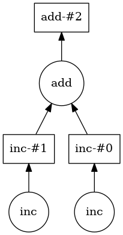

---
title: "Dask"
teaching: 10
exercises: 5
questions:
- "Can we calculate things in parallel?"
objectives:
- "Use Dask to parallelize Python computations"
- "Use Dask arrays to analyze neuroimaging data"
keypoints:
- "If computations lend themselves to parallelization, they can be sped up substantially"
- "Dask provides a whole universe of tools for parallelization"
---

[Dask](http://dask.pydata.org/) takes yet another approach to speeding up
Python computations. One of the main limitations of Python is that in
most cases, a single Python interpreter can only access a single thread
of computation at a time . This is because of the so-called Global
Interpreter Lock (or
[GIL](https://docs.python.org/3/glossary.html#term-global-interpreter-lock)).

And while there is a
[multiprocessing module](https://docs.python.org/3/library/multiprocessing.html)
in the Python standard library, it's use is cumbersome and often requires complicated
decisions. Dask simplifies this substantially, by making the code simpler, and
by making these decisions for you.

Let's look at a simple example:

The following are some very fast and simple calculations, and we add some
`sleep` into them, to simulate a compute-intensive task that takes some
time to complete:

~~~
import time

def inc(x):
    time.sleep(1)
    return x + 1

def add(x, y):
    time.sleep(1)
    return x + y
~~~
{: .python}

Consider the following calculation:

~~~
x1 = inc(1)
x2 = inc(2)
z = add(x1, x2)
~~~
{: .python}

How long would it take to execute this?

Notice that while `z` depends on both `x1` and `x2`, there is no
dependency between `x1` and `x2`. In principle, we could compute both of
them in parallel, but Python doesn't do that out of the box.

One way to convince Python to parallelize these is by telling Dask in
advance about the dependencies between different variables, and letting
it infer how to distribute the computations across threads:

~~~
from dask import delayed

x1 = delayed(inc)(1)
x2 = delayed(inc)(2)
z = delayed(add)(x1, x2)
~~~
{: .python}

Using the `delayed` function (a decorator!) tells Python not to perform the computation
until we're done setting up all the data dependencies. Once we're ready to go we can compute
one or more of the variables:

~~~
z.compute()
~~~

How much time did this take? Why?

Dask computes a task graph for this computation:

Once this graph is computed, Dask can see that the two variables do not
depend on each other, and they can be executed in parallel. So, a
computation that would take 2 seconds serially is immediately sped up
n-fold (with n being the number of independent variables, here 2).

The computations is faster because once the